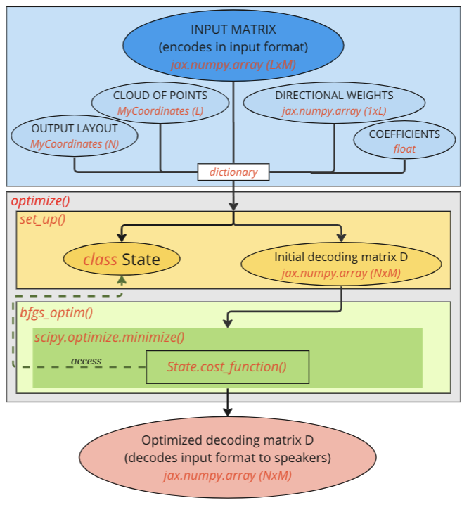

# Universal Transcoder
This code consists of a universal transcoder tool. It generates a
psychoacoustically motivated transcoding matrix to transform from any input
format to any other given format or speaker layout.

## LICENSE

Copyright 2023 Dolby Laboratories

Redistribution and use in source and binary forms, with or without modification, are permitted 
provided that the following conditions are met:

1. Redistributions of source code must retain the above copyright notice, this list of conditions 
and the following disclaimer.

2. Redistributions in binary form must reproduce the above copyright notice, this list of conditions
and the following disclaimer in the documentation and/or other materials provided with the distribution.

3. Neither the name of the copyright holder nor the names of its contributors may be used to endorse or 
promote products derived from this software without specific prior written permission.

THIS SOFTWARE IS PROVIDED BY THE COPYRIGHT HOLDERS AND CONTRIBUTORS “AS IS” AND ANY EXPRESS OR IMPLIED 
WARRANTIES, INCLUDING, BUT NOT LIMITED TO, THE IMPLIED WARRANTIES OF MERCHANTABILITY AND FITNESS FOR A 
PARTICULAR PURPOSE ARE DISCLAIMED. IN NO EVENT SHALL THE COPYRIGHT HOLDER OR CONTRIBUTORS BE LIABLE FOR 
ANY DIRECT, INDIRECT, INCIDENTAL, SPECIAL, EXEMPLARY, OR CONSEQUENTIAL DAMAGES (INCLUDING, BUT NOT LIMITED 
TO, PROCUREMENT OF SUBSTITUTE GOODS OR SERVICES; LOSS OF USE, DATA, OR PROFITS; OR BUSINESS INTERRUPTION)
HOWEVER CAUSED AND ON ANY THEORY OF LIABILITY, WHETHER IN CONTRACT, STRICT LIABILITY, OR TORT (INCLUDING 
NEGLIGENCE OR OTHERWISE) ARISING IN ANY WAY OUT OF THE USE OF THIS SOFTWARE, EVEN IF ADVISED OF THE 
POSSIBILITY OF SUCH DAMAGE.


## Getting started

### Pre-requisites

It is recommended Python 3.8. 

You need the [GEOS](https://libgeos.org/) package. To install it on mac with Homebrew, you can:
```
brew install geos
```

One way to use `universal_transcoder` is to create a virtual environment 
```
python3.8 -m venv venv
source ./venv/bin/activate
```
and install `universal_transcoder` with:
```
pip install -e .
```
Alternatively, you can also install the dependencies from the `requirements.txt` file:
```
pip install -r requirements.txt
```

### Run Code
To run this code, there are 3 files prepared with examples
`case1-2-ambisonics_decoding.py`, `case3-vbap_decoding.py` and `case4-panning_multichannel.py`.
The input format to decode is vbap and ambisonics, respectively. 

The rest of the files contain functions that are involved in the process of obtaining the adequate
decoder matrix.

```
## case3-vbap_decoding.py

import numpy as np

from auxiliars.get_cloud_points import get_equi_circumference_points
from auxiliars.get_input_channels import (
    get_input_channels_vbap,
)
from auxiliars.my_coordinates import MyCoordinates
from calculations.optimization import optimize

# Downmix 5.0 to 3.0 multichannel

input_layout = MyCoordinates.mult_points(
    np.array(
        [
            (-120, 0, 1),
            (-30, 0, 1),
            (0, 0, 1),
            (30, 0, 1),
            (120, 0, 1),
        ]
    )
)

output_layout = MyCoordinates.mult_points(
    np.array(
        [
            (-120, 0, 1),
            (0, 0, 1),
            (120, 0, 1),
        ]
    )
)

cloud_optimization = get_equi_circumference_points(72, False)
input_matrix_optimization = get_input_channels_vbap(cloud_optimization, input_layout)
cloud_plots = get_equi_circumference_points(72, False)
input_matrix_plots = get_input_channels_vbap(cloud_plots, input_layout)

dictionary = {
    "input_matrix_optimization": input_matrix_optimization,
    "cloud_optimization": cloud_optimization,
    "output_layout": output_layout,
    "coefficients": {
        "energy": 0,
        "radial_intensity": 0,
        "transverse_intensity": 0,
        "pressure": 10,
        "radial_velocity": 5,
        "transverse_velocity": 1,
        "in_phase_quad": 0,
        "symmetry_quad": 0,
        "in_phase_lin": 100,
        "symmetry_lin": 2,
        "total_gains_lin": 0,
        "total_gains_quad": 0,
    },
    "directional_weights": 1,
    "show_results": False,
    "save_results": True,
    "results_file_name": "example",
    "input_matrix_plots": input_matrix_plots,
    "cloud_plots": cloud_plots,
}
print(optimize(dictionary))

```

### Run Tests
```
python -m pytest tests 
```

## How it works

The process described in this section is the one implemented in the examples found in `case1-2-ambisonics_decoding.py`, `case3-vbap_decoding.py` and `case4-panning_multichannel.py`.

The input to the system is a dictionary like the following:
```
dictionary = {
            "input_matrix_optimization": input,     # Input matrix that encodes in input format LxM
            "cloud_optimization": cloud,            # Cloud of points sampling the sphere (L)
            "output_layout": output_layout,         # Output layout of speakers to decode
            "coefficients": {                       # List of coefficients to the cost function
                "energy": 0,
                "radial_intensity": 0,
                "transverse_intensity": 0,
                "pressure": 0,
                "radial_velocity": 0,
                "transverse_velocity": 0,
                "in_phase_lin": 0,
                "symmetry_lin": 0,
                "total_gains_quad": 0,
                "in_phase_quad": 0,
                "symmetry_quad": 0,
                "total_gains_quad": 0,
            },
            "directional_weights": 1,               # Weights to directions sampling the sphere (1xL)
            "show_results": True,                   # Flag to show results
            "save_results": False,                  # Flag to save results
            "cloud_plots": cloud,                   # Cloud of points sampling the sphere (P)
            "input_matrix_plots": matrix,           # Matrix that encodes in input format PxM
            "results_file_name": "name",            # String of folder name where to save, if save_results=True
        }
```

Once it is filled in, the only function to call is `optimize()` from `calculations.optimization`.

The following sections will explain in more detail each part of the dictionary and what happens inside `optimize()` function:

#### The clouds - "cloud_optimization" and "cloud_plots"
Variables containing set of points sampling the sphere.

These variables are formatted as MyCoordinates (see `Extended Documentation` section for more information). They can be generated using the functions inside `auxiliars.get_cloud_points`. 

- The data saved in key `"cloud_optimization"` corresponds to the set of points (L points) sampling the sphere in which the optimization is desired. If the output layout is 2D, the most appropiate cloud would be a 2D set of points, which can be generated using `get_equi_circumference_points()` (from `auxiliars.get_cloud_points`). On the other hand, if the output layout to which we aim to decode is 3D, it would be more appropiate to generate a 3D set of sampling points (`get_sphere_points()`, `get_equi_t_design_points()`, `get_equi_fibonacci_sphere_points()`, `get_all_sphere_points()` from `auxiliars.get_cloud_points`). You can use any other function that generated points in the same format. For the opimization, it is recommended to have a set of points that are equally distributed in terms of energy around the sphere.

- For the case of key `"cloud_plots"`, this set of points (P points) corresponds to the sampling directions of the sphere to be shown in the plots if either `"save_results"` or `"show_results"` keys are active. If `"cloud_plots"` is not defined but `"save_results"` or `"show_results"` are active, the program will use `"cloud_optimization"` for the plots. Similarly to the case above, depending on the dimensions of the output layout, `"cloud_plots"` should be set accordingly.


```
from auxiliars.get_cloud_points import get_equi_circumference_points,get_sphere_points,get_all_sphere_points

cloud_2D=get_equi_circumference_points(10)

cloud_3D=get_sphere_points(8)
```


#### The input matrices - "input_matrix_optimization" and "input_matrix_plots"
Variables containing the encoding gains that encode each direction given in a cloud of points in a specific audio format. This constitutes the main input to the system, due to the fact it provides the information about the input format that we aim to decode to a speaker layout.

These variables are formatted as `numpy.Array`. They can be generated using the functions inside `auxiliars.get_input_channels`.

- The data stored in key `"input_matrix_optimization"` corresponds to the encoding gains that encode the set of L directions in the cloud, into the input audio format of M channels. Array of size LxM.

- The data stored in key `"input_matrix_plots"` corresponds to the encoding gains that encode the set of P directions in the cloud, into the input audio format of M channels. Array of size PxM. If "cloud_plots" is not defined but "save_results" or "show_results" are active, the program will use "cloud_optimization" and "input_matrix_optimization" for the plots.

NOTE: Both of these variables must be generated in the same way: different set of points but same encoder.

```
from auxiliars.get_input_channels import get_input_channels_ambisonics,

order=1

#Clouds
cloud_optimization = get_sphere_points(8, False)
cloud_plots = get_all_sphere_points(5, False)

#Input matrices
input_matrix_optimization = get_input_channels_ambisonics(cloud_optimization, order)
input_matrix_plots = get_input_channels_ambisonics(cloud_plots, order)

```

#### Output layout - "output_layout"
Variable containing the set of directions where the speakers to which we aim to decode are located, (N speakers).

These variables are formatted as MyCoordinates (see `Extended Documentation` section for more information). They are generated manually using the methods of MyCoordinates. For example, the method mult_points() generates the variable `layout`receiving as input an array of size Nx3, in which columns correspond respectively to the azimut, elevation, and radius of the speakers.

```
layout = MyCoordinates.mult_points(
    np.array(
        [
            (-120, 0, 1),
            (-30, 0, 1),
            (0, 0, 1),
            (30, 0, 1),
            (120, 0, 1),
        ]
    )
)
```

#### Coefficients - "coefficients"
These variables stablish the different weights given to the different terms of the cost function, consequently giving more or less importance to the different psychoacoustical effects.

These variables are formatted as integers. Set 0 if variable is inactive.

#### Directional weights - "directional_weights"
These variables stablish the different weights given to the different directions of the cloud of points, providing the possibility of giving more or less importance in the optimization to certain zones (for example those points close to speakers in the output), at expense of other zones.

These variables are formatted as a `numpy.array` of size 1xL. Set 1 if directional weightning is unwanted.

#### Results - "show_results" , "save_results" and "results_file_name"

If key `show_results` is active, the system will show plots and print some logs through terminal.

If key `"save_results"` is active, the system will store all the resulting plots and logs in folder `"/saved_results"` inside a new folder called as set in key `"results_file_name"`.


#### Optimize function

In this section, we detail the actual optimization process: what happens when we call `optimize()`?

The following image shows the general process.



Inside `optimize()`, the main processes are: 1) prepare optimization 2) optimization itself and 3) show/save results.

##### 1) Prepare optimization
Calling `set_up_general()` from `calculations.set_up_system` providing as input the dictionary, the outputs are: 

- `current_state` of class `State` (see `Extended Documentation` section for more information) containing all the side information that the cost function needs for its calculations 

- `D_flatten_initial`, the flattened version of the initial decoder matrix that decodes from input format to output layout. It constitutes the only input to the cost function, and therefore, the variable to optimize.

```
current_state, D_flatten_initial = set_up_general(info)
```

##### 2) Optimization
Calling `bfgs_optim()` from `calculations.optimization` the optimization process itself is carried out. For this, `scipy.optimize.minimize()` is called providing the cost function (base function for the optimization) together with `D_flatten_initial` as the initial point for optimization. The function, using BFGS optimization, optimizes the input variable. After a number of iterations and finding, or not, the absolut minum, it returns `D_flatten_optimize`.

##### 3) Show/Save results

Different functions are involved in this section. 
- Inside `bfgs_optimization()` we can find a call to `write_optimization_log` saving or showing the results from the optimization (final cost value, execution time, optimized decoding matrix...) if either `save_results` or `show_results` are active.
- Inside `optimize()`, right after `bfgs_optimization()`, we find a call to `plots_general()`, a function that groups all the plotting functions (found in `e_i_plots.py`, `p_v_plots.py` and `speakers_plots.py`) and saves, or shows them, if either `save_results` or `show_results` are active.

Plots are saved as PNG images.


## Extended documentation
In this section you will find more detailed information about the structure of the code and some specific objects/classes.
### 1) Structure
Below , the tree of the code:

```
├── README.md
├── auxiliars
│   ├── conventions.py
│   ├── get_cloud_points.py
│   ├── get_decoder_matrices.py
│   ├── get_input_channels.py
│   ├── get_left_right_pairs.py
│   └── my_coordinates.py
├── calculations
│   ├── cost_function.py
│   ├── energy_intensity.py
│   ├── optimization.py
│   ├── pressure_velocity.py
│   └── set_up_system.py
├── case1-2-allrad_decoding_results.py
├── case1-2-ambisonics_decoding.py
├── case3-downmix-vbap_decoding.py
├── case4-vbap_decoding_no_optim.py
├── encoders
│   ├── ambisonics_encoder.py
│   └── vbap_encoder.py
├── plots_and_logs
│   ├── all_plots.py
│   ├── common_plots_functions.py
│   ├── e_i_plots.py
│   ├── import_allrad_dec.py
│   ├── p_v_plots.py
│   ├── speakers_plots.py
│   └── write_logs.py
├── requirements.txt
└── tests
    ├── test_ambisonics_encoder.py
    ├── test_decoder_matrices.py
    ├── test_e_i_p_v.py
    └── test_vbap_encoder.py
```
Explanation of the content of each folder
- `Auxiliars` contains all auxiliary functions, that are involved in main processes.
- `Calculations` contains all the main functions: setting up system, optimization, cost function, calculations of energy...
- `Encoders` contains the encoders, used for generating the input matrix. More encoders could be added.
- `Plots and logs` contains all functions involved in the showing or saving of the results.
- `Tests` contains all the tests that check the correct performance of diverse parts of the code.

### 2) MyCoordinates

Class generated out of pyfar.Coordinates to extents its capabilities, mainly those relate with the generation of a Coordinates object and retrieving information from it.

Find this class in `auxiliars.my_coordinates.py`.

Pyfar.Coordinates allow inputs belonging to `[0º,360º]` for azimut angle and `[-90º,90º]` for elevation. The main goal of the created class methods is to allow azimut inputs of `[-180º, 180º]` in the generation of a point or set of points. 

```
import numpy as np
from auxiliars.my_coordinates import MyCoordinates

# Generate a point
point = MyCoordinates.point(-90,45)

# Generate a set of points
set = MyCoordinates.mult_points(
    np.array(
        [
            (-120, 0, 1),
            (-30, 0, 1),
            (0, 0, 1),
            (30, 0, 1),
            (120, 0, 1),
        ]
    )
)

```

Additionally, other methods are meant for retrieving the coordinates of a point or set of points formatted in Coordinates, also with azimut values of `[-180º, 180º]`. Depeding on the method, the retrieved coordinates are in spherical-radians, spherical-degrees or cartesian 

```
import numpy as np
from auxiliars.my_coordinates import MyCoordinates

# Retreive point cartesian coordinates
point_cart = MyCoordinates.cart(point)

# Retreive set of points polar coordinates in degrees
set_degrees = MyCoordinates.sph_deg(set)
```


### 3) State
Class to store all neccessary data for optimization. It also includes the cost function itself as a method, and some other methods needed for the optimization process.

Find this class in `calculations.cost_function.py`.

